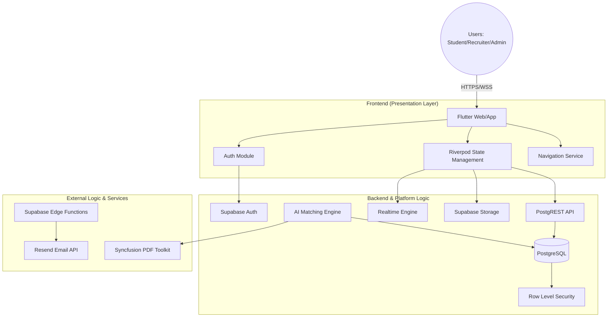
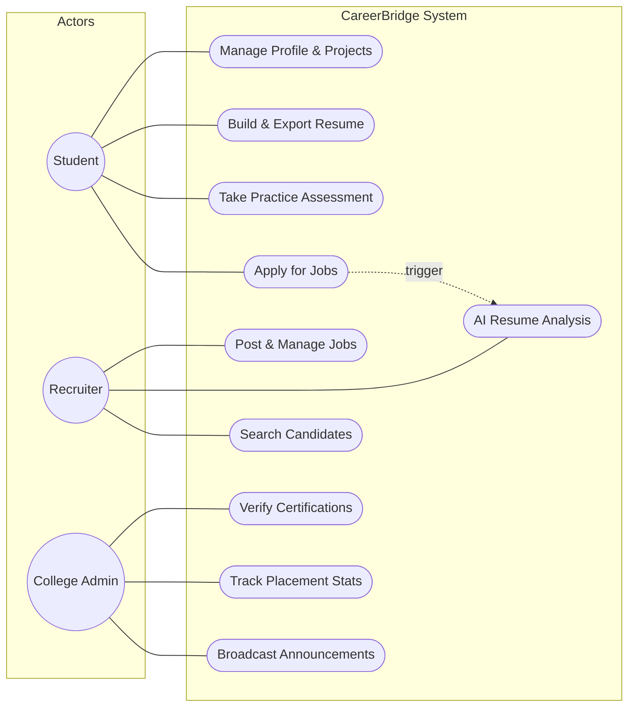

# Chapter 3: System Design

## 3.1 Introduction
System Design is the process of defining the architecture, components, and interfaces of a system to satisfy specified requirements. For **CareerBridge**, the design prioritizes **modularity**, **real-time synchronization**, and **security**. The system is designed using a feature-first approach in Flutter, backed by a scalable serverless architecture on Supabase.

## 3.2 System Architecture

### 3.2.1 High-Level Architecture
CareerBridge follows a modern 3-tier architecture designed for high availability and low latency.

## 3.3 Detailed System Design

### 3.3.1 Modules & Their Functionality

The system is decomposed into several independent but interoperable modules:

| Module | Core Functionality | Key Components |
| :--- | :--- | :--- |
| **Authentication & Identity** | Secure entry and session management. | Supabase Auth, JWT Tokens, Role-based Routing. |
| **Student & Career** | Career identity and skill development. | Resume Builder, Project Cards, Practice Arena. |
| **Recruiter & Job Insights** | Talent acquisition and screening. | Job Management, AI Applicant Insights. |
| **College & Placement** | Institutional oversight. | Placement Tracker, Certificate Verification Engine. |
| **Skill & Certification** | Skill and certificate validation. | Trust Score Calculator, Dept. Validation. |
| **AI Career Assistant** | Natural language navigation and help. | CareerBridge AI (Beta), Local Heuristic Parser. |
| **Networking & Communication** | Professional communication. | Connections, Real-time Messaging & Feed. |

## 3.4 Use Case Diagram
The following diagram illustrates the primary interactions between the different actors and the core system features.

## 3.5 Conclusion
The system design of CareerBridge ensures that the platform is not only functional but also robust and maintainable. By leveraging Flutter's reactive UI and Supabase's integrated backend services, we achieve a high degree of synergy between data and user experience. The modular architecture allows for future expansions, such as blockchain-based verification or native mobile deployment, without disrupting the existing core logic.
