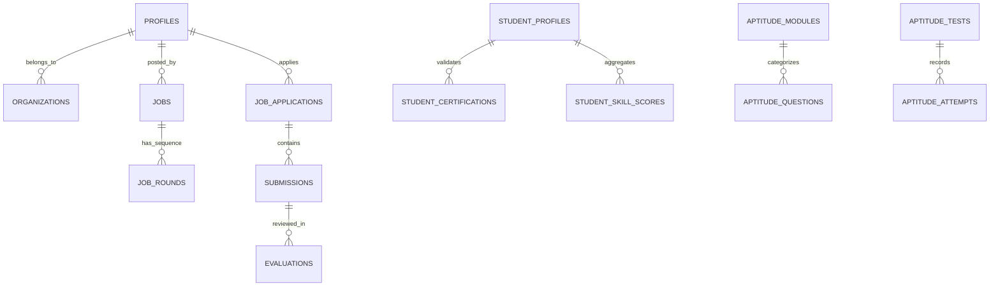

# Chapter 4: Database Design

## 4.1 Introduction
The Database Design of **CareerBridge** is built upon a highly normalized and modular **PostgreSQL** schema managed via Supabase. Significant emphasis is placed on relational integrity through enforced foreign keys and role-based access control via Row-Level Security (RLS). The schema is designed to handle high-concurrency operations across recruitment, institutional management, and real-time learning.

## 4.2 Dataset Overview (Database Overview)
The CareerBridge dataset is structured into logical modules to ensure scalability and maintainability. It consists of over 70 tables, capturing the complete lifecycle of a student from skill acquisition to job placement.

### Module Breakdown:
- **Identity & Institutional**: Manages users, profiles (Student/Recruiter), and organizational hierarchies (Departments/Programs).
- **Recruitment Lifecycle**: Handles job postings, multi-round interview tracking, submissions, evaluations, and offer management.
- **Skill & Validation Engine**: Tracks skill scores, certification validation paths, and provider-specific trust scores.
- **Academic & Aptitude**: Manages learning courses, sections, lectures, and a dedicated aptitude test-taking environment.
- **Engagement & Communication**: Powers the professional feed, networking connections, and automated email/notification logs.

## 4.3 Dataset Structure (ER Diagram)
The following Mermaid diagram provides a high-level view of how the core modules interconnect.

## 4.4 Table Description
The following sections detail the primary tables within each core module.

### 4.4.1 Core Identity Module
| Table | Description | Key Columns |
| :--- | :--- | :--- |
| `profiles` | User-centric identity data extending system auth. | `id`, `role`, `organization_id`, `linkedin_url`, `resume_url` |
| `organizations` | Colleges and Companies metadata. | `id`, `name`, `type` (college/company), `short_code`, `logo_url` |
| `student_profiles` | Academic extensions for student users. | `usn`, `cgpa`, `department_id`, `placement_status`, `placed_package` |

### 4.4.2 Recruitment & Job Module
| Table | Description | Key Columns |
| :--- | :--- | :--- |
| `jobs` | Job postings and screening configs. | `organization_id`, `title`, `requirements`, `status` |
| `job_rounds` | Sequence of interview stages (Video/Technical/HR). | `job_id`, `round_type`, `submission_type`, `is_mandatory` |
| `job_applications` | Connects students to specific job postings. | `job_id`, `student_id`, `status` (applied to hired), `overall_score` |
| `offers` | Final recruitment stage management. | `application_id`, `package_amount`, `offer_letter_url`, `status` |

### 4.4.3 Learning & Certification Module
| Table | Description | Key Columns |
| :--- | :--- | :--- |
| `learning_courses` | Educational content and provider data. | `title`, `provider_name`, `skill_points`, `placement_relevance` |
| `certification_providers` | Trusted external entities (e.g., Coursera, Udemy). | `name`, `trust_score`, `validation_method` |
| `student_certifications` | Student-uploaded certificates for validation. | `certificate_id`, `validation_status`, `skill_points_awarded` |

### 4.4.4 Aptitude & Assessment Module
| Table | Description | Key Columns |
| :--- | :--- | :--- |
| `aptitude_questions` | Question bank for practice and tests. | `module_id`, `options` (JSONB), `correct_answer`, `difficulty` |
| `aptitude_attempts` | Individual student performance records. | `student_id`, `score`, `questions` (Snapshotted JSONB), `status` |

## 4.5 Justification for Dataset Choice
The chosen PostgreSQL schema via Supabase is justified by:
1. **JSONB Flexibility**: Tables like `profiles` and `aptitude_attempts` utilize JSONB for unstructured data (tech stacks, question snapshots) while maintaining SQL performance.
2. **Referential Integrity**: Complex hiring workflows (linking `submissions` to `evaluations`) are strictly enforced via foreign keys, preventing orphaned data.
3. **Advanced Data Types**: Use of arrays (`hashtags`, `skills`) and custom ENUM-like checks (`round_type`, `status`) ensures high data quality at the write level.
4. **Institutional Granularity**: The separation of `organizations` from `profiles` allows for a scalable multi-tenant architecture where colleges can manage hundreds of thousands of student records securely.
