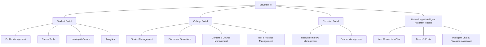
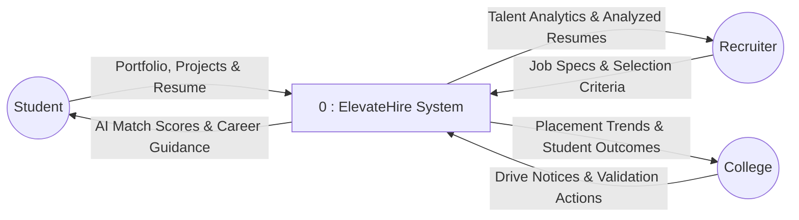
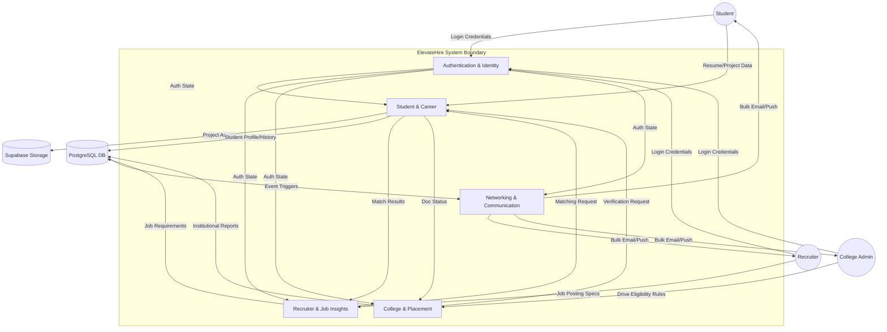

# Chapter 5: Detailed Design

## 5.1 Introduction
The Detailed Design phase translates the high-level system architecture into a granular technical blueprint. For **ElevateHire**, this involves defining the internal logic of Flutter components, the state management flow using Riverpod, and the specific interaction patterns between the frontend features and Supabase backend services. This document serves as the primary reference for the implementation of specific functional modules.

## 5.2 System Overview
ElevateHire is built as a **Feature-First Modular Application**. Instead of a traditional layer-based approach (where all controllers are in one folder and all views in another), the application is split into domain-specific modules (Auth, Student, Recruiter, etc.). Each feature is self-contained, containing its own presentation, domain, and data layers.

### Key Technical Pillars:
- **Presentation Layer**: Built with Material Design 3 and Google Fonts (Outfit). Uses reactive widgets that rebuild only when state changes.
- **State Management**: Managed by **Riverpod**, utilizing `StateNotifierProvider` and `AsyncNotifier` for handling asynchronous data streams from Supabase.
- **Data Access**: Orchestrated via a **Repository Pattern**, ensuring that UI components never communicate directly with the database.

## 5.3 Module-wise Detailed Design (Technical Drill-Down)

### 5.3.1 Authentication & Identity Module
*   **Purpose**: Secure session management and role-based initialization.
*   **Service Components**:
    *   `AuthRepository`: Manages `SupabaseClient` interactions for signing in/out and session persistence.
    *   `RoleGuard`: Interceptor logic that checks the `profiles.role` field before allowing access to specific feature routes.
*   **Internal Flow**: 
    1.  User enters credentials.
    2.  `AuthRepository` verifies via Supabase Auth (JWT).
    3.  On success, `IdentityHelper` fetches full profile metadata.
    4.  Role-based landing page is resolved (Student Home, Recruiter Dashboard, or Admin Panel).

### 5.3.2 Student & Career Module
*   **Purpose**: managing the student's professional lifecycle and aptitude readiness.
*   **Service Components**:
    *   `ResumeMatchingService`: Implements a scoring algorithm comparing `Job.requirements` against `Resume.text_content`.
    *   `ProjectService`: Manages media uploads to `Supabase Storage` and persists links to the `student_projects` table.
    *   `AssessmentEngine`: Tracks `aptitude_attempts`, managing question timers and real-time score calculation.
*   **Internal Flow**:
    1.  Student updates project media.
    2.  Service uploads assets and generates a social feed post via the `Networking` module.
    3.  Skills are automatically recalculated based on project tech-stacks and successful assessment completions.

### 5.3.3 Recruiter & Job Insights Module
*   **Purpose**: Applicant screening and intelligence-driven hiring.
*   **Service Components**:
    *   `JobRepository`: Handles the transactional creation of job listings and their associated `job_rounds`.
    *   `ApplicantScanner`: A batch processing logic that runs the `ResumeMatchingService` across all new applications to provide a "Top Matches" list.
*   **Internal Flow**:
    1.  Recruiter defines job requirements.
    2.  As applications arrive, the `Scanner` triggers a local NLP parse of the resume.
    3.  A "Match Score" is persisted in the `job_applications` table for instant recruiter filtering.

### 5.3.4 College & Placement Module
*   **Purpose**: Institutional oversight, verification, and placement drive management.
*   **Service Components**:
    *   `VerificationService`: Flags certifications using the `validation_rules` table to determine if an auto-approval is possible or if manual admin review is required.
    *   `AnalyticsService`: Performs SQL aggregation queries to calculate placement percentages and package distributions across `college_departments`.
*   **Internal Flow**:
    1.  Student uploads a certificate.
    2.  `VerificationService` checks provider trust scores.
    3.  Admin dashboard notifies the user of pending approvals, which update the student's "Trust Score" upon completion.

### 5.3.5 Networking & Communication Module
*   **Purpose**: professional engagement and automated notification delivery.
*   **Service Components**:
    *   `NotificationService`: Monitors app state and triggers bulk emails via the `Resend` Edge Function for critical updates (e.g., job shortlisting).
    *   `InteractionManager`: Handles real-time reactivity for likes, comments, and connection requests using Supabase Realtime WSS.
*   **Internal Flow**:
    1.  Recruiter shortlists an applicant.
    2.  `NotificationService` detects the state change in `job_applications`.
    3.  An automated personalized email is dispatched to the student via the platform's email service.

## 5.4 Modular Decomposition Components
The application is decomposed into the following core components to ensure maintainability:

1.  **Shared UI Components**: Reusable widgets like `AppButton`, `ProfileTile`, and `StatusChip` located in `lib/core/widgets`.
2.  **Navigation Service**: A centralized routing system handling deep links and protected routes.
3.  **Supabase Client Service**: A singleton provider ensuring a single persistent connection to the backend.
4.  **Local Rule Engine**: Heuristic-based logic for the AI Career Assistant that parses natural language queries into system actions.

## 5.5 Modular Architecture Principles
ElevateHire adheres to a feature-driven modular architecture, ensuring that each subsystem is isolated, testable, and maintainable. This approach facilitates horizontal scaling of development teams and simplifies the integration of new career-focused tools.

## 5.6 System Structure Chart
The following chart illustrates the hierarchical functional modules and their specific sub-functions within the ElevateHire ecosystem, organized by user portals and shared assistance modules.



## 5.7 Data Flow Architecture
The following diagrams illustrate the flow of information through ElevateHire. We use a hierarchical approach, starting with the high-level Context Diagram (Level-0) and then decomposing it into the modular interactions (Level-1).

### 5.7.1 Level-0 Data Flow Diagram (Context Diagram)
The Context Diagram defines the system boundary and its interactions with external actors.



### 5.7.2 Level-1 Data Flow Diagram (Decomposed DFD)
The Level-1 DFD illustrates the internal movement of data between core modules and data persistence layers.



## 5.8 Structure of the Software Package
The codebase follows a standardized directory structure to support team scalability:

```text
lib/
├── core/               # Global utilities, themes, and shared widgets
├── features/           # Modular functional units
│   ├── auth/           # Login, Signup, Role logic
│   ├── student/        # Profile, Resume, Projects, Assessment
│   ├── recruiter/      # Job Posting, Applicant Tracking, Insights
│   ├── college/        # Dashboard, Verification, Batches
│   └── networking/     # Social feed, Connections, Messaging
├── app.dart            # Main application entry point
└── main.dart           # Initialization (Firebase, Supabase, Riverpod)
```

Each feature folder is further structured into:
- **presentation/**: Widgets and UI state controllers (Providers).
- **domain/**: Business logic models and service interfaces.
- **data/**: Concrete repository implementations and data sources (Supabase APIs).
